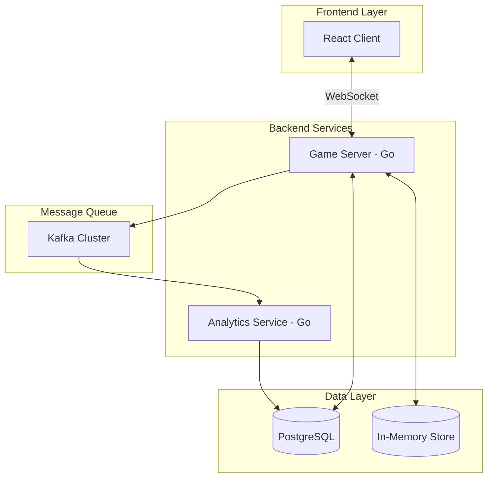

# Design Document

## Overview

The Connect 4 multiplayer system is a distributed real-time gaming platform consisting of three main components: a Go backend server for game logic and WebSocket communication, a React frontend for user interaction, and a Kafka-based analytics pipeline for game metrics processing. The system supports player-vs-player and player-vs-bot gameplay with intelligent bot opponents using minimax algorithm with alpha-beta pruning.

## Architecture

The system follows a microservices architecture applying proven design principles for maintainability, scalability, and robustness:



### Design Principles Applied

#### SOLID Principles Implementation

**Single Responsibility Principle (SRP)**
- **Game Engine**: Only handles Connect 4 game logic and rules
- **WebSocket Manager**: Only manages client connections and message routing
- **Bot AI Engine**: Only implements minimax algorithm and move selection
- **Analytics Service**: Only processes events and generates metrics
- **Matchmaking Service**: Only handles player pairing and queue management

**Open/Closed Principle (OCP)**
- **Bot AI Interface**: Extensible for different difficulty levels or algorithms without modifying existing code
- **Event Publishers**: New event types can be added without changing core game logic
- **Database Adapters**: New storage backends can be added via interface implementation

**Liskov Substitution Principle (LSP)**
- **Player Interface**: Human players and bot players are interchangeable in game sessions
- **Storage Interface**: In-memory and persistent storage implementations are substitutable
- **Event Handlers**: Different event processors can replace each other seamlessly

**Interface Segregation Principle (ISP)**
- **Separate interfaces** for GameReader, GameWriter, and GameValidator instead of one large GameManager
- **Distinct WebSocket interfaces** for connection management vs message handling
- **Focused bot interfaces** for move calculation vs position evaluation

**Dependency Inversion Principle (DIP)**
- **High-level game logic** depends on abstractions (interfaces), not concrete implementations
- **Database operations** injected via interfaces, allowing easy testing and swapping
- **Event publishing** abstracted behind interfaces for different message queue implementations

#### DRY (Don't Repeat Yourself) Implementation

**Shared Components**
- **Common data models** in `pkg/models/` used across all services
- **Reusable WebSocket utilities** for connection management and message serialization
- **Shared validation logic** for game moves and player actions
- **Common error handling patterns** across all services
- **Unified logging and metrics collection** utilities

**Code Reuse Examples**
- **Board validation logic** shared between game engine and bot AI
- **Event serialization** used by both game server and analytics service
- **Database connection pooling** abstracted into reusable package
- **WebSocket reconnection logic** standardized across client implementations

#### KISS (Keep It Simple, Stupid) Implementation

**Simple Architecture Decisions**
- **Direct WebSocket communication** instead of complex message brokers for real-time gameplay
- **In-memory game state** with simple persistence rather than complex distributed state management
- **Straightforward REST APIs** for non-real-time operations (leaderboard, statistics)
- **Standard PostgreSQL** instead of complex NoSQL solutions for structured game data
- **Docker Compose** for local development instead of complex orchestration

**Avoiding Over-Engineering**
- **No microservice mesh** - simple point-to-point communication
- **No complex caching layers** - Redis-like in-memory operations with PostgreSQL persistence
- **No event sourcing** - direct state updates with audit logging
- **Standard HTTP/WebSocket** protocols instead of custom protocols

#### Additional Principles

**YAGNI (You Aren't Gonna Need It)**
- **No premature optimization** for millions of concurrent users
- **No complex sharding** until proven necessary
- **No advanced AI features** beyond minimax requirements
- **No complex deployment pipelines** until scale demands it

**High Cohesion, Low Coupling**
- **Each service** has a single, well-defined purpose
- **Services communicate** via well-defined interfaces (WebSocket, Kafka, REST)
- **Minimal shared state** between services
- **Clear boundaries** between game logic, communication, and analytics

### Component Responsibilities

- **Game Server**: Manages game sessions, WebSocket connections, matchmaking, and bot AI
- **React Client**: Provides user interface for gameplay and leaderboard viewing  
- **Analytics Service**: Processes Kafka events and generates game metrics
- **PostgreSQL**: Stores completed games, player statistics, and analytics data
- **In-Memory Store**: Maintains active game sessions for performance
- **Kafka**: Decouples analytics from game logic for scalability

## Components and Interfaces

### Game Server (Go)

**Core Modules (Following SRP):**
- **WebSocket Manager**: Handles client connections using [gorilla/websocket](https://github.com/gorilla/websocket)
- **Game Engine**: Implements Connect 4 logic, win detection, and move validation
- **Matchmaking Service**: Pairs players and manages game queues
- **Bot AI Engine**: Implements minimax algorithm with alpha-beta pruning
- **Session Manager**: Maintains active games in memory with Redis-like operations
- **Analytics Publisher**: Sends events to Kafka using [confluent-kafka-go](https://github.com/confluentinc/confluent-kafka-go)

**Interface Design (Following ISP & DIP):**

```go
// Segregated interfaces instead of monolithic ones
type GameReader interface {
    GetGameState(gameID string) (*GameState, error)
    GetActiveGames() ([]string, error)
}

type GameWriter interface {
    CreateGame(player1, player2 string) (*GameSession, error)
    MakeMove(gameID string, playerID string, column int) error
    EndGame(gameID string, winner Player) error
}

type GameValidator interface {
    ValidateMove(board *Board, column int) bool
    ValidatePlayer(gameID string, playerID string) bool
}

// Composable game engine following SRP
type GameEngine interface {
    GameReader
    GameWriter
    GameValidator
}

// Bot AI with focused responsibilities
type MoveCalculator interface {
    GetBestMove(board *Board, depth int) int
}

type PositionEvaluator interface {
    EvaluatePosition(board *Board, player Player) int
}

type BotAI interface {
    MoveCalculator
    PositionEvaluator
}

// Storage abstraction following DIP
type GameStorage interface {
    Store(game *GameSession) error
    Load(gameID string) (*GameSession, error)
    Delete(gameID string) error
}

// Event publishing abstraction
type EventPublisher interface {
    PublishGameEvent(event GameEvent) error
    PublishPlayerEvent(event PlayerEvent) error
}
```

### React Frontend

**Component Structure (Following SRP & Component Composition):**
- **App**: Main application container with routing and global state
- **GameBoard**: Pure component for 7×6 grid display with click handlers
- **GameLobby**: Handles username input and matchmaking interface
- **Leaderboard**: Displays player rankings and statistics
- **GameStatus**: Shows current turn, winner display, and game controls
- **ConnectionStatus**: Manages and displays WebSocket connection state

**Custom Hooks (DRY Implementation):**
```typescript
// Reusable WebSocket logic
const useWebSocket = (url: string) => {
  // Shared reconnection logic, connection state management
}

// Shared game state management
const useGameState = () => {
  // Common game state operations used across components
}

// Reusable player statistics
const usePlayerStats = () => {
  // Shared logic for fetching and managing player data
}
```

**Service Layer (Following SRP):**
```typescript
// Focused service responsibilities
class WebSocketService {
  // Only handles WebSocket communication
}

class GameAPIService {
  // Only handles REST API calls
}

class LocalStorageService {
  // Only handles browser storage operations
}
```

**WebSocket Integration (KISS Principle):**
- Uses native WebSocket API for simplicity
- Implements automatic reconnection with exponential backoff
- Handles connection state management without complex libraries
- Simple message routing based on message type

### Analytics Service (Go)

**Processing Pipeline (Following SRP & DRY):**
- **Event Consumer**: Single responsibility for consuming Kafka messages
- **Event Validator**: Validates and sanitizes incoming events
- **Metrics Calculator**: Transforms events into aggregated statistics
- **Database Writer**: Handles persistence operations
- **Report Generator**: Creates analytics reports and dashboards

**Shared Components (DRY Implementation):**
```go
// Reusable event processing utilities
type EventProcessor interface {
    Process(event GameEvent) (*ProcessedMetric, error)
}

// Common database operations
type MetricsRepository interface {
    Store(metric ProcessedMetric) error
    Query(filters MetricFilters) ([]ProcessedMetric, error)
}

// Shared validation logic
type EventValidator interface {
    Validate(event GameEvent) error
    Sanitize(event GameEvent) GameEvent
}
```

**Metrics Tracked (Following KISS):**
- **Simple aggregations**: Average game duration, win rates
- **Time-based metrics**: Games per hour/day with straightforward bucketing
- **Player analytics**: Engagement metrics without complex behavioral modeling
- **System metrics**: Basic performance and error rate tracking

**Processing Strategy:**
- **Batch processing** for non-real-time metrics to reduce complexity
- **Simple in-memory aggregation** with periodic database writes
- **Straightforward SQL queries** instead of complex analytics engines

## Data Models

### Shared Models (DRY Principle)
All data models are defined in `pkg/models/` and shared across services to eliminate duplication:

### Game Session
```go
type GameSession struct {
    ID          string    `json:"id" db:"id"`
    Player1     string    `json:"player1" db:"player1"`
    Player2     string    `json:"player2" db:"player2"`
    Board       Board     `json:"board" db:"board"`
    CurrentTurn Player    `json:"currentTurn" db:"current_turn"`
    Status      GameStatus `json:"status" db:"status"`
    Winner      *Player   `json:"winner,omitempty" db:"winner"`
    StartTime   time.Time `json:"startTime" db:"start_time"`
    EndTime     *time.Time `json:"endTime,omitempty" db:"end_time"`
    MoveHistory []Move    `json:"moveHistory" db:"move_history"`
}

// Simple, focused validation (SRP)
func (gs *GameSession) Validate() error {
    // Single responsibility: only validate game session data
}

func (gs *GameSession) IsActive() bool {
    return gs.Status == StatusInProgress
}
```

### Board (KISS Implementation)
```go
type Board struct {
    Grid   [6][7]Player `json:"grid" db:"grid"`
    Height [7]int       `json:"height" db:"height"` // Track column heights for O(1) operations
}

// Simple operations following KISS
func (b *Board) IsValidMove(column int) bool {
    return column >= 0 && column < 7 && b.Height[column] < 6
}

func (b *Board) MakeMove(column int, player Player) error {
    if !b.IsValidMove(column) {
        return ErrInvalidMove
    }
    row := b.Height[column]
    b.Grid[row][column] = player
    b.Height[column]++
    return nil
}
```

### Move (Simple Structure)
```go
type Move struct {
    Player    Player    `json:"player" db:"player"`
    Column    int       `json:"column" db:"column"`
    Row       int       `json:"row" db:"row"`       // Calculated for easy win detection
    Timestamp time.Time `json:"timestamp" db:"timestamp"`
}
```

### Player Statistics (Focused Data)
```go
type PlayerStats struct {
    Username     string    `json:"username" db:"username"`
    GamesPlayed  int       `json:"gamesPlayed" db:"games_played"`
    GamesWon     int       `json:"gamesWon" db:"games_won"`
    WinRate      float64   `json:"winRate" db:"win_rate"`        // Calculated field
    AvgGameTime  int       `json:"avgGameTime" db:"avg_game_time"` // In seconds
    LastPlayed   time.Time `json:"lastPlayed" db:"last_played"`
    CreatedAt    time.Time `json:"createdAt" db:"created_at"`
}

// Simple calculation methods (SRP)
func (ps *PlayerStats) CalculateWinRate() {
    if ps.GamesPlayed > 0 {
        ps.WinRate = float64(ps.GamesWon) / float64(ps.GamesPlayed)
    }
}
```

### Analytics Events (Standardized Structure)
```go
type GameEvent struct {
    EventType   EventType              `json:"eventType" db:"event_type"`
    GameID      string                 `json:"gameId" db:"game_id"`
    PlayerID    string                 `json:"playerId" db:"player_id"`
    Timestamp   time.Time             `json:"timestamp" db:"timestamp"`
    Metadata    map[string]interface{} `json:"metadata" db:"metadata"`
}

// Event types following clear naming convention
type EventType string

const (
    EventGameStarted    EventType = "game_started"
    EventMoveMade       EventType = "move_made"
    EventGameCompleted  EventType = "game_completed"
    EventPlayerJoined   EventType = "player_joined"
    EventPlayerLeft     EventType = "player_left"
)
```

### Error Types (Consistent Error Handling)
```go
// Standardized error types across all services
var (
    ErrInvalidMove     = errors.New("invalid move")
    ErrGameNotFound    = errors.New("game not found")
    ErrPlayerNotFound  = errors.New("player not found")
    ErrGameFull        = errors.New("game is full")
    ErrNotPlayerTurn   = errors.New("not player's turn")
    ErrGameEnded       = errors.New("game has ended")
)

// Error wrapper for consistent error handling
type GameError struct {
    Code    string `json:"code"`
    Message string `json:"message"`
    Details string `json:"details,omitempty"`
}
```

## Bot AI Implementation

The competitive bot uses a minimax algorithm with alpha-beta pruning for strategic decision-making:

### Algorithm Details
- **Search Depth**: 7 levels (configurable based on performance requirements)
- **Evaluation Function**: Considers center column preference, threat detection, and winning opportunities
- **Alpha-Beta Pruning**: Reduces search space by 50-90% for faster response times
- **Move Ordering**: Prioritizes center columns first for better pruning efficiency

### Strategic Priorities
1. **Immediate Win**: If bot can win in one move, take it
2. **Block Opponent Win**: If opponent can win next turn, block them
3. **Create Threats**: Build multiple winning opportunities
4. **Center Control**: Prefer center columns for better positioning
5. **Avoid Traps**: Don't create opportunities for opponent

### Performance Optimization
- **Transposition Table**: Cache evaluated positions to avoid recalculation
- **Iterative Deepening**: Start with shallow search, increase depth if time permits
- **Move Ordering**: Evaluate promising moves first for better pruning

## WebSocket Communication Protocol

### Message Types

**Client to Server:**
```json
{
  "type": "join_game",
  "payload": {
    "username": "player1"
  }
}

{
  "type": "make_move",
  "payload": {
    "gameId": "game-123",
    "column": 3
  }
}

{
  "type": "reconnect",
  "payload": {
    "gameId": "game-123",
    "username": "player1"
  }
}
```

**Server to Client:**
```json
{
  "type": "game_started",
  "payload": {
    "gameId": "game-123",
    "opponent": "player2",
    "yourColor": "red",
    "currentTurn": "red"
  }
}

{
  "type": "move_made",
  "payload": {
    "gameId": "game-123",
    "player": "red",
    "column": 3,
    "board": [[0,0,0,0,0,0,0], ...],
    "nextTurn": "yellow"
  }
}

{
  "type": "game_ended",
  "payload": {
    "gameId": "game-123",
    "winner": "red",
    "reason": "connect_four"
  }
}
```

## Correctness Properties

*A property is a characteristic or behavior that should hold true across all valid executions of a system—essentially, a formal statement about what the system should do. Properties serve as the bridge between human-readable specifications and machine-verifiable correctness guarantees.*

<function_calls>
<invoke name="prework">
<parameter name="featureName">connect-4-multiplayer

After reviewing the prework analysis, I'll consolidate redundant properties and focus on the most valuable correctness properties:

**Property Reflection:**
- Properties 1.1 and 1.5 can be combined into a comprehensive matchmaking property
- Properties 2.2, 2.3, and 2.4 can be combined into a comprehensive bot strategy property
- Properties 3.1 and 3.2 can be combined into a real-time communication property
- Properties 4.1, 4.2, and 4.3 can be combined into a reconnection management property
- Properties 5.1 and 5.2 can be combined into a move validation property
- Properties 6.1 and 6.2 can be combined into a game persistence property
- Properties 9.1, 9.2, 9.3, and 9.4 can be combined into a comprehensive analytics event property

### Core Correctness Properties

**Property 1: Matchmaking Queue Management**
*For any* player with a valid username, joining the matchmaking queue should either pair them with another waiting player or start a bot game within 10 seconds, ensuring no duplicate usernames in active sessions.
**Validates: Requirements 1.1, 1.2, 1.3, 1.5**

**Property 2: Bot Strategic Decision Making**
*For any* game board state, when the bot has a winning move available it should take it, when the opponent has a winning threat it should block it, and it should never make invalid moves.
**Validates: Requirements 2.2, 2.3, 2.4, 2.6**

**Property 3: Bot Response Time**
*For any* game board state, the bot should analyze and make its move within 1 second.
**Validates: Requirements 2.1**

**Property 4: Real-time Game State Synchronization**
*For any* game state change or player move, all connected clients should receive the updated state within 100ms.
**Validates: Requirements 3.1, 3.2, 3.3**

**Property 5: Client Reconnection Resilience**
*For any* WebSocket connection failure, the client should attempt automatic reconnection.
**Validates: Requirements 3.5**

**Property 6: Session Reconnection Management**
*For any* player disconnection, the game session should be maintained for 30 seconds, allow reconnection with state restoration, or forfeit after timeout.
**Validates: Requirements 4.1, 4.2, 4.3, 4.4, 4.5**

**Property 7: Game Move Validation and Physics**
*For any* attempted move, the system should validate column availability and place discs in the lowest available position.
**Validates: Requirements 5.1, 5.2**

**Property 8: Win and Draw Detection**
*For any* game board state, the system should correctly detect 4-in-a-row wins (vertical, horizontal, diagonal) and draws when the board is full.
**Validates: Requirements 5.3, 5.4**

**Property 9: Game Session Lifecycle**
*For any* completed game, the system should update statistics, close the session, and clean up memory.
**Validates: Requirements 5.5, 6.5**

**Property 10: Game Data Persistence**
*For any* completed game session, the system should store complete game data including players, winner, duration, and move history.
**Validates: Requirements 6.1, 6.2**

**Property 11: Server Recovery**
*For any* server restart scenario, active games should be restored from persistent storage.
**Validates: Requirements 6.4**

**Property 12: Leaderboard Statistics Accuracy**
*For any* player, the system should accurately track games played, wins, and win percentage, updating in real-time.
**Validates: Requirements 7.1, 7.3, 7.5**

**Property 13: Leaderboard Data Retrieval**
*For any* leaderboard request, the system should return the top 10 players sorted by wins.
**Validates: Requirements 7.2, 7.4**

**Property 14: User Interface Interaction**
*For any* column click in the game interface, the client should send the move to the server.
**Validates: Requirements 8.3**

**Property 15: UI Animation Consistency**
*For any* valid move, the client should animate the disc drop to the correct position.
**Validates: Requirements 8.4**

**Property 16: Game End UI Response**
*For any* game ending, the client should display the result and play again option.
**Validates: Requirements 8.5**

**Property 17: Analytics Event Publishing**
*For any* game event (start, move, end, connection change), the system should publish complete event data to Kafka with player IDs, timestamps, and metadata.
**Validates: Requirements 9.1, 9.2, 9.3, 9.4, 9.5**

**Property 18: Analytics Event Processing**
*For any* analytics event consumed from Kafka, the analytics service should process it and store metrics including game duration, winner frequency, and time-based statistics.
**Validates: Requirements 10.1, 10.2, 10.3, 10.4, 10.5**

## Error Handling

### Game Server Error Scenarios
- **Invalid Move Attempts**: Return error message, maintain current game state
- **WebSocket Connection Drops**: Implement exponential backoff reconnection
- **Database Connection Failures**: Queue operations in memory, retry with circuit breaker
- **Kafka Publishing Failures**: Use local buffer with retry mechanism
- **Bot AI Timeouts**: Fallback to simpler heuristic move selection

### Frontend Error Handling
- **WebSocket Disconnection**: Show connection status, attempt reconnection
- **Invalid Game States**: Request fresh state from server
- **Network Timeouts**: Display user-friendly error messages
- **Malformed Server Responses**: Log errors, request state refresh

### Analytics Service Error Handling
- **Kafka Consumer Failures**: Implement dead letter queue for failed events
- **Database Write Failures**: Retry with exponential backoff
- **Event Processing Errors**: Log and skip malformed events
- **Memory Overflow**: Implement batch processing with size limits

## Testing Strategy

### Dual Testing Approach
The system will use both unit tests and property-based tests for comprehensive coverage:

- **Unit Tests**: Verify specific examples, edge cases, and error conditions
- **Property Tests**: Verify universal properties across all inputs using generated test data
- Both approaches are complementary and necessary for ensuring system correctness

### Property-Based Testing Configuration
- **Testing Framework**: [Testify](https://github.com/stretchr/testify) with [gopter](https://github.com/leanovate/gopter) for property-based testing
- **Test Iterations**: Minimum 100 iterations per property test
- **Test Tagging**: Each property test tagged with format: **Feature: connect-4-multiplayer, Property {number}: {property_text}**

### Unit Testing Focus Areas
- **Game Logic**: Specific win/draw scenarios, edge cases
- **Bot AI**: Known good/bad positions, performance benchmarks  
- **WebSocket Handling**: Connection lifecycle, message parsing
- **Database Operations**: CRUD operations, transaction handling
- **Kafka Integration**: Message serialization, consumer group behavior

### Property Testing Focus Areas
- **Game State Invariants**: Board consistency, turn alternation
- **Move Validation**: All possible board states and column selections
- **Win Detection**: All possible winning configurations
- **Bot Behavior**: Strategic decision-making across board states
- **Real-time Communication**: Message delivery and timing
- **Data Persistence**: Round-trip consistency for all game data

### Integration Testing
- **End-to-End Game Flow**: Complete game scenarios from matchmaking to completion
- **Multi-Client Testing**: Concurrent player interactions
- **Failure Recovery**: Network partitions, server restarts, database failures
- **Performance Testing**: Load testing with multiple concurrent games
- **Analytics Pipeline**: Event flow from game server through Kafka to analytics service

### Testing Infrastructure
- **Docker Compose**: Local development environment with all services
- **Test Databases**: Isolated PostgreSQL instances for testing
- **Mock Kafka**: In-memory Kafka for unit tests
- **WebSocket Testing**: Automated client simulation for real-time testing
- **CI/CD Pipeline**: Automated testing on pull requests and