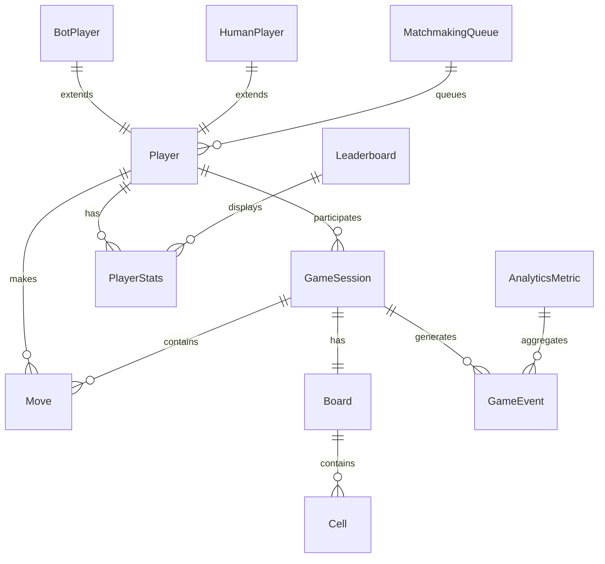

# Core Entities and Relationships - Connect 4 Multiplayer System

## Overview

This document defines the core entities, their relationships, and class design for the Connect 4 multiplayer system. The design follows Domain-Driven Design (DDD) principles with clear entity boundaries and relationships.

## Entity Relationship Diagram



## Core Domain Entities

### 1. Player Entity

**Purpose**: Represents a game participant (human or bot)

```go
type Player struct {
    ID       string    `json:"id" db:"id"`
    Username string    `json:"username" db:"username"`
    Type     PlayerType `json:"type" db:"type"`
    Status   PlayerStatus `json:"status" db:"status"`
    CreatedAt time.Time `json:"createdAt" db:"created_at"`
    LastSeen  time.Time `json:"lastSeen" db:"last_seen"`
}

type PlayerType string
const (
    PlayerTypeHuman PlayerType = "human"
    PlayerTypeBot   PlayerType = "bot"
)

type PlayerStatus string
const (
    PlayerStatusOnline    PlayerStatus = "online"
    PlayerStatusInGame    PlayerStatus = "in_game"
    PlayerStatusOffline   PlayerStatus = "offline"
    PlayerStatusQueued    PlayerStatus = "queued"
)

// Domain methods
func (p *Player) IsAvailable() bool {
    return p.Status == PlayerStatusOnline
}

func (p *Player) CanJoinGame() bool {
    return p.Status == PlayerStatusOnline || p.Status == PlayerStatusQueued
}

func (p *Player) IsBot() bool {
    return p.Type == PlayerTypeBot
}
```

**Relationships**:
- One-to-Many with GameSession (can participate in multiple games over time)
- One-to-One with PlayerStats (has statistics)
- One-to-Many with Move (makes moves in games)

### 2. GameSession Entity

**Purpose**: Represents an active or completed game between two players

```go
type GameSession struct {
    ID          string        `json:"id" db:"id"`
    Player1ID   string        `json:"player1Id" db:"player1_id"`
    Player2ID   string        `json:"player2Id" db:"player2_id"`
    Player1     *Player       `json:"player1,omitempty"` // Loaded via relationship
    Player2     *Player       `json:"player2,omitempty"` // Loaded via relationship
    Board       *Board        `json:"board"`
    CurrentTurn PlayerColor   `json:"currentTurn" db:"current_turn"`
    Status      GameStatus    `json:"status" db:"status"`
    Winner      *PlayerColor  `json:"winner,omitempty" db:"winner"`
    WinReason   *WinReason    `json:"winReason,omitempty" db:"win_reason"`
    StartTime   time.Time     `json:"startTime" db:"start_time"`
    EndTime     *time.Time    `json:"endTime,omitempty" db:"end_time"`
    MoveHistory []Move        `json:"moveHistory"`
    Metadata    GameMetadata  `json:"metadata" db:"metadata"`
}

type GameStatus string
const (
    GameStatusWaiting    GameStatus = "waiting"
    GameStatusInProgress GameStatus = "in_progress"
    GameStatusCompleted  GameStatus = "completed"
    GameStatusAbandoned  GameStatus = "abandoned"
)

type PlayerColor string
const (
    PlayerColorRed    PlayerColor = "red"
    PlayerColorYellow PlayerColor = "yellow"
)

type WinReason string
const (
    WinReasonConnect4     WinReason = "connect_four"
    WinReasonForfeit      WinReason = "forfeit"
    WinReasonTimeout      WinReason = "timeout"
    WinReasonDisconnect   WinReason = "disconnect"
)

type GameMetadata struct {
    BotDifficulty *int    `json:"botDifficulty,omitempty"`
    GameMode      string  `json:"gameMode"`
    ServerVersion string  `json:"serverVersion"`
}

// Domain methods
func (gs *GameSession) IsActive() bool {
    return gs.Status == GameStatusInProgress
}

func (gs *GameSession) GetCurrentPlayer() *Player {
    if gs.CurrentTurn == PlayerColorRed {
        return gs.Player1
    }
    return gs.Player2
}

func (gs *GameSession) GetOpponent(playerID string) *Player {
    if gs.Player1ID == playerID {
        return gs.Player2
    }
    return gs.Player1
}

func (gs *GameSession) GetPlayerColor(playerID string) PlayerColor {
    if gs.Player1ID == playerID {
        return PlayerColorRed
    }
    return PlayerColorYellow
}

func (gs *GameSession) Duration() time.Duration {
    if gs.EndTime != nil {
        return gs.EndTime.Sub(gs.StartTime)
    }
    return time.Since(gs.StartTime)
}

func (gs *GameSession) SwitchTurn() {
    if gs.CurrentTurn == PlayerColorRed {
        gs.CurrentTurn = PlayerColorYellow
    } else {
        gs.CurrentTurn = PlayerColorRed
    }
}
```

**Relationships**:
- Many-to-One with Player (two players per game)
- One-to-One with Board (has a game board)
- One-to-Many with Move (contains move history)
- One-to-Many with GameEvent (generates analytics events)

### 3. Board Entity

**Purpose**: Represents the Connect 4 game board state

```go
type Board struct {
    ID       string           `json:"id" db:"id"`
    GameID   string           `json:"gameId" db:"game_id"`
    Grid     [6][7]PlayerColor `json:"grid" db:"grid"`
    Heights  [7]int           `json:"heights" db:"heights"` // Column heights for O(1) operations
    LastMove *Position        `json:"lastMove,omitempty" db:"last_move"`
}

type Position struct {
    Row    int `json:"row"`
    Column int `json:"column"`
}

// Domain methods
func (b *Board) IsValidMove(column int) bool {
    return column >= 0 && column < 7 && b.Heights[column] < 6
}

func (b *Board) MakeMove(column int, player PlayerColor) (*Position, error) {
    if !b.IsValidMove(column) {
        return nil, ErrInvalidMove
    }
    
    row := b.Heights[column]
    b.Grid[row][column] = player
    b.Heights[column]++
    
    position := &Position{Row: row, Column: column}
    b.LastMove = position
    return position, nil
}

func (b *Board) CheckWin(lastMove Position, player PlayerColor) bool {
    return b.checkDirection(lastMove, player, 1, 0) ||  // Horizontal
           b.checkDirection(lastMove, player, 0, 1) ||  // Vertical
           b.checkDirection(lastMove, player, 1, 1) ||  // Diagonal /
           b.checkDirection(lastMove, player, 1, -1)    // Diagonal \
}

func (b *Board) IsFull() bool {
    for _, height := range b.Heights {
        if height < 6 {
            return false
        }
    }
    return true
}

func (b *Board) GetValidMoves() []int {
    var moves []int
    for col := 0; col < 7; col++ {
        if b.IsValidMove(col) {
            moves = append(moves, col)
        }
    }
    return moves
}

// Private helper method
func (b *Board) checkDirection(pos Position, player PlayerColor, deltaRow, deltaCol int) bool {
    count := 1 // Count the piece just placed
    
    // Check positive direction
    count += b.countInDirection(pos, player, deltaRow, deltaCol)
    // Check negative direction
    count += b.countInDirection(pos, player, -deltaRow, -deltaCol)
    
    return count >= 4
}
```

**Relationships**:
- One-to-One with GameSession (belongs to a game)
- Composed of Cell positions (conceptual relationship)

### 4. Move Entity

**Purpose**: Represents a single move made by a player

```go
type Move struct {
    ID        string      `json:"id" db:"id"`
    GameID    string      `json:"gameId" db:"game_id"`
    PlayerID  string      `json:"playerId" db:"player_id"`
    Player    *Player     `json:"player,omitempty"` // Loaded via relationship
    Color     PlayerColor `json:"color" db:"color"`
    Column    int         `json:"column" db:"column"`
    Row       int         `json:"row" db:"row"`
    MoveNumber int        `json:"moveNumber" db:"move_number"`
    Timestamp time.Time   `json:"timestamp" db:"timestamp"`
    Duration  int64       `json:"duration" db:"duration"` // Time taken to make move in ms
}

// Domain methods
func (m *Move) GetPosition() Position {
    return Position{Row: m.Row, Column: m.Column}
}

func (m *Move) IsValid() bool {
    return m.Column >= 0 && m.Column < 7 && m.Row >= 0 && m.Row < 6
}
```

**Relationships**:
- Many-to-One with GameSession (belongs to a game)
- Many-to-One with Player (made by a player)

### 5. PlayerStats Entity

**Purpose**: Aggregated statistics for a player

```go
type PlayerStats struct {
    ID              string    `json:"id" db:"id"`
    PlayerID        string    `json:"playerId" db:"player_id"`
    Player          *Player   `json:"player,omitempty"` // Loaded via relationship
    GamesPlayed     int       `json:"gamesPlayed" db:"games_played"`
    GamesWon        int       `json:"gamesWon" db:"games_won"`
    GamesLost       int       `json:"gamesLost" db:"games_lost"`
    GamesDraw       int       `json:"gamesDraw" db:"games_draw"`
    WinRate         float64   `json:"winRate" db:"win_rate"`
    AvgGameDuration int64     `json:"avgGameDuration" db:"avg_game_duration"` // In seconds
    AvgMoveTime     int64     `json:"avgMoveTime" db:"avg_move_time"`         // In milliseconds
    LongestWinStreak int      `json:"longestWinStreak" db:"longest_win_streak"`
    CurrentStreak   int       `json:"currentStreak" db:"current_streak"`
    LastPlayed      time.Time `json:"lastPlayed" db:"last_played"`
    CreatedAt       time.Time `json:"createdAt" db:"created_at"`
    UpdatedAt       time.Time `json:"updatedAt" db:"updated_at"`
}

// Domain methods
func (ps *PlayerStats) UpdateAfterGame(won bool, gameDuration time.Duration) {
    ps.GamesPlayed++
    ps.LastPlayed = time.Now()
    
    if won {
        ps.GamesWon++
        ps.CurrentStreak++
        if ps.CurrentStreak > ps.LongestWinStreak {
            ps.LongestWinStreak = ps.CurrentStreak
        }
    } else {
        ps.GamesLost++
        ps.CurrentStreak = 0
    }
    
    ps.CalculateWinRate()
    ps.UpdateAvgGameDuration(gameDuration)
    ps.UpdatedAt = time.Now()
}

func (ps *PlayerStats) CalculateWinRate() {
    if ps.GamesPlayed > 0 {
        ps.WinRate = float64(ps.GamesWon) / float64(ps.GamesPlayed)
    }
}

func (ps *PlayerStats) GetRank() PlayerRank {
    if ps.GamesPlayed < 10 {
        return PlayerRankUnranked
    }
    
    switch {
    case ps.WinRate >= 0.8:
        return PlayerRankExpert
    case ps.WinRate >= 0.6:
        return PlayerRankAdvanced
    case ps.WinRate >= 0.4:
        return PlayerRankIntermediate
    default:
        return PlayerRankBeginner
    }
}

type PlayerRank string
const (
    PlayerRankUnranked     PlayerRank = "unranked"
    PlayerRankBeginner     PlayerRank = "beginner"
    PlayerRankIntermediate PlayerRank = "intermediate"
    PlayerRankAdvanced     PlayerRank = "advanced"
    PlayerRankExpert       PlayerRank = "expert"
)
```

**Relationships**:
- One-to-One with Player (statistics for a player)

## Service Layer Entities

### 6. MatchmakingQueue Entity

**Purpose**: Manages player matchmaking and queue state

```go
type MatchmakingQueue struct {
    ID          string              `json:"id"`
    QueuedPlayers []QueuedPlayer    `json:"queuedPlayers"`
    CreatedAt   time.Time           `json:"createdAt"`
    UpdatedAt   time.Time           `json:"updatedAt"`
}

type QueuedPlayer struct {
    PlayerID    string    `json:"playerId"`
    Player      *Player   `json:"player,omitempty"`
    QueuedAt    time.Time `json:"queuedAt"`
    Preferences MatchPreferences `json:"preferences"`
}

type MatchPreferences struct {
    PreferHuman bool `json:"preferHuman"`
    SkillLevel  *PlayerRank `json:"skillLevel,omitempty"`
}

// Domain methods
func (mq *MatchmakingQueue) AddPlayer(player *Player, preferences MatchPreferences) {
    queuedPlayer := QueuedPlayer{
        PlayerID:    player.ID,
        Player:      player,
        QueuedAt:    time.Now(),
        Preferences: preferences,
    }
    mq.QueuedPlayers = append(mq.QueuedPlayers, queuedPlayer)
    mq.UpdatedAt = time.Now()
}

func (mq *MatchmakingQueue) FindMatch() (*QueuedPlayer, *QueuedPlayer) {
    if len(mq.QueuedPlayers) < 2 {
        return nil, nil
    }
    
    // Simple FIFO matching for now
    player1 := mq.QueuedPlayers[0]
    player2 := mq.QueuedPlayers[1]
    
    mq.QueuedPlayers = mq.QueuedPlayers[2:]
    return &player1, &player2
}

func (mq *MatchmakingQueue) GetWaitingPlayers() []QueuedPlayer {
    var waiting []QueuedPlayer
    timeout := time.Now().Add(-10 * time.Second)
    
    for _, qp := range mq.QueuedPlayers {
        if qp.QueuedAt.Before(timeout) {
            waiting = append(waiting, qp)
        }
    }
    return waiting
}
```

### 7. BotPlayer Entity

**Purpose**: Specialized player entity for AI opponents

```go
type BotPlayer struct {
    Player                    // Embedded Player entity
    Difficulty   BotDifficulty `json:"difficulty" db:"difficulty"`
    Algorithm    string        `json:"algorithm" db:"algorithm"`
    SearchDepth  int          `json:"searchDepth" db:"search_depth"`
    ResponseTime int64        `json:"responseTime" db:"response_time"` // Average response time in ms
}

type BotDifficulty string
const (
    BotDifficultyEasy   BotDifficulty = "easy"
    BotDifficultyMedium BotDifficulty = "medium"
    BotDifficultyHard   BotDifficulty = "hard"
    BotDifficultyExpert BotDifficulty = "expert"
)

// Domain methods
func (bp *BotPlayer) GetSearchDepth() int {
    switch bp.Difficulty {
    case BotDifficultyEasy:
        return 3
    case BotDifficultyMedium:
        return 5
    case BotDifficultyHard:
        return 7
    case BotDifficultyExpert:
        return 9
    default:
        return 5
    }
}

func (bp *BotPlayer) ShouldDelay() time.Duration {
    // Add human-like delay based on difficulty
    switch bp.Difficulty {
    case BotDifficultyEasy:
        return time.Duration(500+rand.Intn(1000)) * time.Millisecond
    case BotDifficultyMedium:
        return time.Duration(300+rand.Intn(700)) * time.Millisecond
    default:
        return time.Duration(100+rand.Intn(300)) * time.Millisecond
    }
}
```

## Analytics Entities

### 8. GameEvent Entity

**Purpose**: Represents events for analytics processing

```go
type GameEvent struct {
    ID          string                 `json:"id" db:"id"`
    EventType   EventType             `json:"eventType" db:"event_type"`
    GameID      string                `json:"gameId" db:"game_id"`
    PlayerID    string                `json:"playerId" db:"player_id"`
    Timestamp   time.Time             `json:"timestamp" db:"timestamp"`
    Metadata    map[string]interface{} `json:"metadata" db:"metadata"`
    ProcessedAt *time.Time            `json:"processedAt,omitempty" db:"processed_at"`
}

type EventType string
const (
    EventGameStarted     EventType = "game_started"
    EventMoveMade        EventType = "move_made"
    EventGameCompleted   EventType = "game_completed"
    EventPlayerJoined    EventType = "player_joined"
    EventPlayerLeft      EventType = "player_left"
    EventPlayerReconnected EventType = "player_reconnected"
    EventBotMoveCalculated EventType = "bot_move_calculated"
)

// Domain methods
func (ge *GameEvent) IsProcessed() bool {
    return ge.ProcessedAt != nil
}

func (ge *GameEvent) MarkProcessed() {
    now := time.Now()
    ge.ProcessedAt = &now
}
```

### 9. AnalyticsMetric Entity

**Purpose**: Aggregated metrics from game events

```go
type AnalyticsMetric struct {
    ID          string                 `json:"id" db:"id"`
    MetricType  MetricType            `json:"metricType" db:"metric_type"`
    Period      TimePeriod            `json:"period" db:"period"`
    PeriodStart time.Time             `json:"periodStart" db:"period_start"`
    PeriodEnd   time.Time             `json:"periodEnd" db:"period_end"`
    Value       float64               `json:"value" db:"value"`
    Count       int64                 `json:"count" db:"count"`
    Metadata    map[string]interface{} `json:"metadata" db:"metadata"`
    CreatedAt   time.Time             `json:"createdAt" db:"created_at"`
}

type MetricType string
const (
    MetricAvgGameDuration    MetricType = "avg_game_duration"
    MetricGamesPerHour       MetricType = "games_per_hour"
    MetricPlayerRetention    MetricType = "player_retention"
    MetricBotWinRate         MetricType = "bot_win_rate"
    MetricAvgMovesPerGame    MetricType = "avg_moves_per_game"
    MetricPeakConcurrentUsers MetricType = "peak_concurrent_users"
)

type TimePeriod string
const (
    PeriodHourly  TimePeriod = "hourly"
    PeriodDaily   TimePeriod = "daily"
    PeriodWeekly  TimePeriod = "weekly"
    PeriodMonthly TimePeriod = "monthly"
)
```

## Repository Interfaces

### Following DIP (Dependency Inversion Principle)

```go
// Player repository interface
type PlayerRepository interface {
    Create(player *Player) error
    GetByID(id string) (*Player, error)
    GetByUsername(username string) (*Player, error)
    Update(player *Player) error
    Delete(id string) error
    GetOnlinePlayers() ([]*Player, error)
}

// GameSession repository interface
type GameSessionRepository interface {
    Create(session *GameSession) error
    GetByID(id string) (*GameSession, error)
    GetActiveGames() ([]*GameSession, error)
    GetPlayerActiveGame(playerID string) (*GameSession, error)
    Update(session *GameSession) error
    Delete(id string) error
}

// PlayerStats repository interface
type PlayerStatsRepository interface {
    Create(stats *PlayerStats) error
    GetByPlayerID(playerID string) (*PlayerStats, error)
    GetLeaderboard(limit int) ([]*PlayerStats, error)
    Update(stats *PlayerStats) error
    UpdateAfterGame(playerID string, won bool, duration time.Duration) error
}

// Move repository interface
type MoveRepository interface {
    Create(move *Move) error
    GetGameMoves(gameID string) ([]*Move, error)
    GetPlayerMoves(playerID string, limit int) ([]*Move, error)
}
```

## Domain Services

### Following SRP (Single Responsibility Principle)

```go
// Game domain service
type GameService interface {
    CreateGame(player1ID, player2ID string) (*GameSession, error)
    MakeMove(gameID, playerID string, column int) (*Move, error)
    EndGame(gameID string, reason WinReason) error
    GetGameState(gameID string) (*GameSession, error)
}

// Matchmaking domain service
type MatchmakingService interface {
    JoinQueue(playerID string, preferences MatchPreferences) error
    LeaveQueue(playerID string) error
    ProcessQueue() ([]*GameSession, error)
    GetQueueStatus() (*MatchmakingQueue, error)
}

// Bot domain service
type BotService interface {
    CreateBot(difficulty BotDifficulty) (*BotPlayer, error)
    CalculateMove(botID string, board *Board) (int, error)
    GetBotStats(botID string) (*PlayerStats, error)
}
```

## Summary

This entity design provides:

1. **Clear Domain Boundaries**: Each entity has well-defined responsibilities
2. **Rich Domain Models**: Entities contain business logic, not just data
3. **Proper Relationships**: Clear associations between entities
4. **Repository Pattern**: Data access abstracted behind interfaces
5. **Domain Services**: Complex business logic encapsulated in services
6. **Analytics Support**: Events and metrics for comprehensive tracking

The design supports all requirements while maintaining clean architecture principles and enabling easy testing and maintenance.